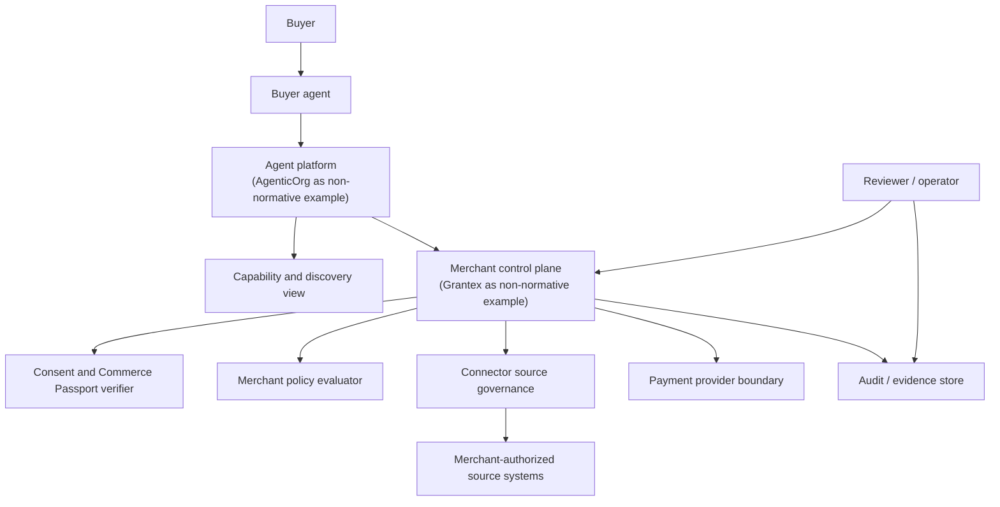

# Securing Agentic Commerce: Reference Architecture for Consent, Merchant Policy, Audit Evidence, and Payment Safety

Status: internal draft-preparation artifact only.

Created: 2026-06-09.

This document is an internal NIST-aligned whitepaper skeleton. It has not been
submitted to NIST, has not been accepted by NCCoE, is not NIST-approved, is not
public guidance, and is not certification. It is not an IETF submission, public
protocol publication, production approval, public discovery authorization,
checkout/payment authorization, provider authorization, or live-payment
authorization.

This skeleton uses public-safe but internal language for security architecture
review. Grantex and AgenticOrg appear only as non-normative implementation
examples. This document does not define a Grantex-specific requirement,
AgenticOrg-specific requirement, payment-provider requirement, production
configuration, allowlist, credential, secret, merchant private API, live-payment
behavior, or runtime enablement.

## 1. Executive Summary

Agentic commerce allows buyer agents and agent platforms to discover merchant
capabilities, assist buyer decisions, request carts, initiate consent flows, and
coordinate checkout-related actions. These workflows create useful automation,
but they also introduce security and safety risks when agents can influence
commerce actions across buyer, merchant, connector, provider, and operator
boundaries.

This internal skeleton outlines a NIST-aligned security reference architecture
for agentic commerce. It focuses on consent, merchant policy, audit evidence,
connector source governance, payment safety, refusal behavior, and rollback.
The architecture is intended to help reviewers reason about control objectives,
threats, evidence, residual risks, and production blockers before any external
engagement or public publication is considered.

The central security claim is:

> A protected commerce action should advance only when buyer consent, scoped
> authority, merchant policy, tenant boundary, source freshness, provider
> boundary, and audit evidence controls all permit the action.

This skeleton is not a product launch approval, standards claim, provider
approval, or certification claim.

## 2. Problem Statement

Traditional ecommerce assumes that a buyer interacts directly with a merchant
site, app, marketplace, or support channel. Agentic commerce adds software and
AI agents that can read merchant capability data, interpret product content,
assemble carts, request consent, or ask a merchant control plane to progress
toward payment.

Without explicit controls, an agentic commerce system can:

- let a malicious or compromised agent exceed buyer intent;
- treat product or connector content as trusted instructions;
- expose stale price, catalog, inventory, delivery, refund, or support facts;
- overexpose merchant capabilities through discovery profiles;
- blur the boundary between agent-facing surfaces and merchant private systems;
- bypass payment-provider controls;
- leak tenant, merchant, buyer, credential, or private source data;
- accept synthetic, demo, or sandbox evidence as production approval;
- lack durable evidence for refusal, consent, policy, payment, and rollback
  decisions.

The architecture in this skeleton frames those risks as control objectives and
assurance evidence rather than as protocol certification or public guidance.

## 3. Scope and Assumptions

This skeleton covers the security architecture for agent-mediated commerce
where a merchant-authorized control plane mediates requests from buyer agents or
agent platforms.

In scope:

- actor and asset inventory;
- trust boundaries;
- threat model;
- control objectives;
- NIST AI RMF mapping;
- cybersecurity control themes;
- agentic commerce safety controls;
- payment safety and provider-boundary controls;
- privacy and data minimization;
- audit evidence and evidence retention;
- incident response and rollback;
- assurance evidence;
- residual risks and blocked production gates;
- NIST/NCCoE engagement planning.

Out of scope:

- NIST submission;
- NCCoE acceptance or collaborator request;
- IETF submission;
- public protocol publication;
- public guidance publication;
- certification, conformance, or compliance claim;
- production Commerce V1 enablement;
- public discovery enablement;
- checkout/payment creation enablement;
- live payment enablement;
- live Plural enablement;
- payment-provider calls;
- merchant private API calls;
- production allowlists;
- cloud resources, deployments, migrations, routes, workflows, configs, portal
  UI, or runtime behavior.

Assumptions:

- merchants remain responsible for authorizing capability exposure and private
  system access;
- buyer consent is separate from agent authentication;
- agent platforms do not become the merchant source of truth;
- provider credentials and provider execution stay behind governed merchant
  control-plane boundaries;
- connector source data is mediated, freshness-checked, and governed by
  source-of-truth precedence;
- unsafe states fail closed with structured refusal behavior;
- internal preview, sandbox, synthetic, dry-run, remediation, or rehearsal
  evidence is not production approval.

## 4. Reference Architecture

The reference architecture separates buyer-facing, agent-facing,
merchant-control, connector-source, provider, and audit/operator boundaries.
Protected actions pass through consent, policy, source, provider, and evidence
checks before they advance.

Core design rules:

- buyer agents request actions through governed merchant-control-plane
  interfaces;
- agent platforms do not directly call payment providers;
- agent platforms do not directly call merchant private APIs;
- public-safe discovery is not checkout/payment authorization;
- cart, checkout, and payment-affecting actions require consent, policy,
  scope, tenant, source, provider, idempotency, and audit checks;
- audit and evidence stores receive redacted decision references rather than
  secrets, credentials, raw private payloads, concrete production configuration
  values, or concrete allowlist values.

## 5. Actor and Asset Inventory

| Actor or asset | Security role | Sensitive or governed assets |
| --- | --- | --- |
| Buyer | Source of buyer-specific authorization and revocation. | Consent decisions, identity binding, amount and scope limits. |
| Buyer agent | Acts for the buyer within declared scope. | Session context, requested actions, refusal handling. |
| Merchant | Owns capability exposure, readiness, policy, source-of-truth, and rollback. | Merchant identity, catalog, price, inventory, policy, approvals. |
| Merchant control plane | Mediates agent-facing requests and protected commerce actions. | Policy decisions, consent verification, cart and payment references, audit references. |
| AgenticOrg / agent platform | Hosts or mediates the buyer-agent experience as an implementation example. | Channel identity, session attribution, tool-call requests, refusal display. |
| Connector sources | Supply merchant-authorized data or metadata. | Source health, source precedence, freshness, conflict state, import results. |
| Payment provider | Performs payment-provider functions behind governed boundaries. | Provider references, checkout status, webhook events, reconciliation state. |
| Reviewer/operator | Reviews blockers, evidence, incidents, and rollback state. | Readiness notes, review decisions, incident records, remediation actions. |
| Audit/evidence store | Preserves durable redacted evidence for protected decisions. | Consent references, policy versions, event references, hashes, timestamps. |

Grantex and AgenticOrg are examples of possible implementation experience only.
They do not define mandatory NIST, NCCoE, protocol, provider, or ecosystem
requirements in this skeleton.

## 6. Trust Boundaries

Buyer to buyer agent:

: The agent may assist but does not replace buyer consent. Buyer intent should
  be represented as scoped, revocable authority before protected actions.

Buyer agent to agent platform:

: The platform mediates requests and displays results. It should not silently
  expand scope, suppress refusal, or treat prompt context as payment authority.

Agent platform to merchant control plane:

: The merchant control plane is the enforcement boundary for capabilities,
  consent, policy, tenant scope, source state, provider boundary, and evidence.

Merchant control plane to connector sources:

: Connectors supply governed data or metadata. Agents should not directly
  execute against private merchant source systems.

Merchant control plane to payment provider:

: Provider access occurs through governed provider-boundary controls. Provider
  credentials, provider-specific payloads, and provider calls stay outside
  agent systems.

Merchant control plane to audit/evidence store:

: Evidence should be durable, redacted, attributable, and reviewable. Protected
  actions should not be acknowledged without the required evidence.

Operator to control and evidence planes:

: Operators can inspect, disable, roll back, and remediate. Operator review does
  not imply public discovery approval, production approval, provider approval,
  or live-payment approval.

## 7. Threat Model

| Threat | Risk scenario | Control objectives |
| --- | --- | --- |
| Malicious or compromised buyer agent | Agent attempts to buy outside buyer intent, manipulate scope, or suppress refusal. | Bind protected actions to scoped consent, agent identity, expiry, revocation, amount caps, and audit evidence. |
| Prompt injection | Product, support, connector, or channel content instructs the agent to bypass rules. | Treat untrusted content as data, not instruction; require policy and provider-boundary checks outside the model context. |
| Stale catalog, price, or inventory | Agent promises an unavailable item, wrong price, or unsupported delivery state. | Enforce freshness checks, source precedence, conflict handling, and refusal on stale or conflicting data. |
| Overbroad consent | Buyer authorizes more action than intended or cannot revoke authority. | Use narrow scopes, merchant binding, amount caps, short expiry, revocation, and clear consent records. |
| Cross-tenant data exposure | Data or authority from one tenant or merchant is visible to another. | Require tenant filtering, tenant-bound keys, tenant-bound audit, and negative tenant-boundary tests. |
| Provider boundary bypass | Agent platform or buyer agent calls provider APIs or handles provider credentials. | Keep provider credentials and provider execution in merchant control plane; reject direct provider paths. |
| Merchant private API exposure | Agent or agent platform directly calls ERP, PIM, storefront, OMS, support, or payment systems. | Mediate private systems through governed connectors and expose only public-safe or channel-safe views. |
| Audit tampering | Protected action lacks durable evidence or evidence can be edited after the fact. | Use append-only evidence patterns, redacted references, immutable timestamps, and compensating events for corrections. |
| Unsafe public discovery | Unapproved merchant, sandbox capability, or blocked channel appears discoverable. | Separate discovery readiness, approval, environment, and allowlist controls; fail closed when unclear. |
| Synthetic or demo data treated as approval | Internal examples, fixtures, dry-runs, or demos are interpreted as production readiness. | Label synthetic/demo evidence clearly and require separate production gates, legal/provider approval, and rollback ownership. |

## 8. Control Objectives

1. Attribute each protected action to buyer, buyer agent, agent platform,
   merchant, tenant, and policy context.
2. Separate agent authentication from buyer consent.
3. Require scoped, revocable, short-lived authority for protected actions.
4. Enforce merchant policy before cart, checkout, payment, or private-state
   progression.
5. Preserve tenant and merchant isolation across every request and evidence
   reference.
6. Keep provider credentials and provider calls behind governed
   merchant-control-plane boundaries.
7. Keep merchant private APIs behind connector governance and source precedence.
8. Minimize public-safe and buyer-facing data to the fields needed for the
   action.
9. Fail closed when source freshness, consent, policy, provider readiness,
   environment, or audit evidence is missing.
10. Emit durable, redacted evidence for protected decisions and refusals.
11. Treat sandbox, synthetic, demo, dry-run, or remediation evidence as
   assurance input only, not production approval.
12. Maintain incident response, disablement, and rollback paths for capability,
   connector, provider, and discovery mistakes.

## 9. NIST AI RMF Mapping

This mapping is an internal alignment aid. It is not NIST approval, NIST
publication, NIST public-comment submission, NCCoE acceptance, certification,
or compliance.

| AI RMF function | Agentic commerce interpretation | Candidate evidence |
| --- | --- | --- |
| Govern | Define owners, responsibilities, policy authority, production gates, stop conditions, and review workflows. | Role inventory, policy owner records, launch blocker matrix, review decisions, rollback ownership. |
| Map | Identify context, actors, assets, data flows, trust boundaries, source systems, provider paths, channels, and impacted users. | Architecture diagram, actor and asset inventory, trust-boundary analysis, data-flow notes, threat model. |
| Measure | Evaluate controls, refusals, tenant boundaries, stale-state behavior, public-safe previews, secret exposure, and connector dry-runs. | C6O conformance results, refusal tests, tenant-boundary tests, secret/private scans, dry-run evidence, audit tests. |
| Manage | Operate controls, respond to incidents, revoke authority, disable capabilities, roll back discovery, and track residual risks. | Runbooks, incident records, revocation evidence, emergency disable evidence, rollback rehearsal, residual risk register. |

## 10. Cybersecurity Control Themes

| Theme | Control expectation |
| --- | --- |
| Identity and access | Buyer, agent, merchant, tenant, platform, provider-boundary, and operator identities are attributable where relevant. |
| Least privilege | Capabilities are constrained by merchant, channel, tenant, agent trust, product, amount, scope, environment, and expiry. |
| Data minimization | Public-safe and buyer-facing views exclude private merchant artifacts, raw payloads, credentials, and production configuration values. |
| Credential protection | Provider and connector credentials are not placed in docs, logs, fixtures, examples, agent systems, or public-safe outputs. |
| Auditability | Protected actions and significant refusals produce durable redacted evidence with policy and consent references. |
| Integrity | Cart, amount, currency, policy, consent, source freshness, and evidence references can be validated or compared. |
| Resilience | Stale, unavailable, conflicting, or disabled sources fail closed with safe refusal and operator visibility. |
| Incident response | Discovery, connector, provider, consent, audit, and cross-tenant mistakes have disablement, rollback, and review paths. |

## 11. Agentic Commerce Safety Controls

Grantex-only commerce facts:

: In the Grantex/AgenticOrg implementation example, buyer-facing agent answers
  and commerce actions should be based on Grantex-approved capability and
  commerce facts, not invented channel state or direct source-system access.

No AgenticOrg direct provider calls:

: AgenticOrg is an implementation example of an agent platform and should not
  hold payment-provider credentials or call payment providers directly.

No AgenticOrg direct merchant private API calls:

: Agent platforms should use governed merchant-control-plane tools or public-safe
  capability views, not direct private merchant APIs.

Consent, passport, policy, and audit for protected actions:

: Protected actions should require consent/passport context, merchant policy,
  scope checks, amount and currency checks, revocation handling, tenant
  boundary checks, idempotency, and audit evidence.

Public-safe preview boundaries:

: Preview, discovery, and standards-adapter materials should not include real
  merchant private artifacts, credentials, production identifiers, raw payloads,
  concrete allowlists, or production configuration.

Connector source governance:

: Connector metadata should include source type, source health, freshness,
  precedence, conflict state, dry-run evidence, and remediation state without
  exposing private payloads to unauthorized agent surfaces.

Refusal behavior:

: Refusals should be first-class results with safe reason codes. Agents should
  refuse or ask for review when consent, policy, freshness, source, provider,
  tenant, environment, or evidence checks fail.

## 12. Payment Safety and Provider-Boundary Controls

Payment safety depends on keeping payment progression behind governed merchant
control-plane checks.

Candidate controls:

- payment-affecting actions require buyer consent and merchant policy approval;
- consent is scoped by merchant, capability, amount, currency, expiry, and
  revocation state;
- checkout/payment progression is blocked if catalog price, inventory, tax,
  delivery, or source data is stale or conflicting;
- idempotency keys prevent duplicate payment-affecting progression;
- provider credentials are stored and used only within governed
  merchant-control-plane boundaries;
- agent platforms do not hold provider credentials;
- agent platforms and buyer agents do not call provider APIs directly;
- provider errors are normalized before reaching buyer-facing or agent-facing
  surfaces;
- provider-specific payloads and metadata are redacted from public-safe views;
- provider outages, webhook failures, reconciliation gaps, and invalid state
  transitions produce refusal, audit, and operator-visible evidence;
- live payment and live provider paths remain blocked until separate legal,
  provider, data-residency, operational, and rollback approvals exist.

This skeleton does not enable checkout/payment creation, live payments, live
Plural, direct payment-provider calls, or production Commerce V1 behavior.

## 13. Privacy and Data Minimization

Privacy controls should reduce collection, disclosure, and retention to the
minimum needed for safe commerce decisions.

Candidate practices:

- separate public-safe merchant fields from private merchant artifacts;
- avoid exposing raw connector payloads to buyers, public docs, or agent
  platforms;
- use redacted evidence references instead of private record disclosure;
- avoid storing secrets, raw credentials, private URLs, or private payloads in
  examples, logs, documentation, or public-safe previews;
- bind buyer consent to a specific scope, merchant, amount, currency, expiry,
  and revocation path;
- keep channel identity binding proportionate to the action;
- avoid cross-channel or cross-tenant tracking unless needed for security,
  consent, support, or legal obligations;
- define retention and deletion dependencies for consent records, audit
  references, source evidence, and payment-related records;
- restrict sensitive category data and regulated-offer details to authorized
  surfaces.

## 14. Audit Evidence and Evidence Retention

Audit evidence should make protected actions and refusals reviewable without
leaking private artifacts.

Evidence should capture:

- buyer, buyer-agent, merchant, tenant, and platform references where
  appropriate;
- consent/passport reference, scope, expiry, revocation state, and amount cap;
- merchant policy version and decision reference;
- cart, price, currency, source freshness, and source precedence references;
- provider-boundary readiness or refusal state;
- idempotency reference for payment-affecting actions;
- refusal code and safe remediation guidance;
- operator/reviewer decision references where used;
- timestamps and correlation identifiers using synthetic or redacted values in
  examples.

Evidence should avoid:

- secrets;
- raw credentials;
- provider credentials;
- raw private connector payloads;
- private URLs;
- concrete production configuration values;
- concrete allowlist values;
- real merchant names or production identifiers in internal draft examples.

Retention planning should identify which evidence is needed for buyer support,
merchant support, incident response, legal review, provider dispute handling,
security investigation, rollback, and deletion/export workflows.

## 15. Incident Response and Rollback

Incident response should assume mistakes can happen in discovery, consent,
policy, connector, provider, evidence, tenant-boundary, or agent-channel
behavior.

Candidate incident scenarios:

- unapproved merchant appears discoverable;
- stale or conflicting source data reaches an agent-facing view;
- consent scope is ambiguous or too broad;
- policy blocks are not displayed clearly;
- cross-tenant data exposure is suspected;
- provider-boundary checks fail or are bypassed;
- merchant private source data appears in an unauthorized surface;
- audit evidence is missing or incomplete;
- synthetic/demo data is mistaken for approval;
- live mode, live provider, or public discovery appears enabled without
  approval.

Candidate response controls:

- emergency disable for merchant, capability, channel, connector source, or
  provider path;
- revocation for consent/passport authority;
- capability downgrade to read-only or blocked;
- public discovery rollback;
- connector source disablement or freshness quarantine;
- refusal reason updates;
- evidence export for review;
- compensating audit events for corrections;
- post-incident review with residual risk updates.

## 16. Assurance Evidence

Assurance evidence is internal evidence for readiness review. It is not
certification, conformance, NIST approval, NCCoE acceptance, provider approval,
or production approval.

Expected evidence categories:

- C6O conformance gate results for internal preview expectations;
- refusal tests for denied consent, missing consent, stale inventory, disabled
  merchant, disabled agent, amount cap breach, unsupported offer, and payment
  status polling;
- tenant-boundary tests for cross-tenant negative cases;
- secret/private scans for docs, examples, fixtures, logs, and evidence
  packets;
- connector dry-run and remediation evidence for source health, freshness,
  precedence, redaction, operator review, and blocked launch states;
- audit tests showing protected actions and refusals emit durable evidence;
- rollback rehearsal for discovery, connector, provider, and capability
  exposure mistakes.

## 17. Residual Risks and Blocked Production Gates

Residual risks remain until separate evidence, approvals, and operational
readiness exist.

Blocked gates include:

- NIST submission or NCCoE engagement without explicit approval;
- public publication without public-safe review and approval;
- certification or conformance claims without a reviewed external program and
  evidence;
- public discovery without merchant, legal, operator, source, and rollback
  approval;
- production Commerce V1 without release-gate evidence;
- checkout/payment creation without consent, policy, idempotency, source,
  provider-readiness, audit, and rollback evidence;
- live payments and live Plural without legal, provider, data-residency,
  webhook, outage, reconciliation, and rollback approval;
- provider calls from agent platforms or buyer agents;
- merchant private API calls from agent platforms or buyer agents;
- concrete production allowlists or production configuration changes without
  separate approval;
- treating synthetic, sandbox, demo, fixture, dry-run, remediation, triage, or
  rehearsal output as production approval.

## 18. NIST/NCCoE Engagement Plan

This plan is internal and preparatory. It is not a NIST submission, public
comment submission, NCCoE acceptance, NIST approval, or public guidance.

Candidate steps:

1. Complete internal whitepaper skeleton and security-review pass.
2. Remove or generalize implementation-specific details that are not
   public-safe.
3. Confirm no real merchant names, production identifiers, secrets, private
   URLs, provider credentials, raw payloads, concrete allowlists, or production
   config values are present.
4. Map control objectives to NIST AI RMF functions and selected cybersecurity
   control themes.
5. Prepare a generalized project-description concept for possible external
   collaboration.
6. Identify possible collaborator categories only after public-safe scope
   approval.
7. Seek legal, security, product, provider, and executive review before any
   external engagement.

## 19. Open Questions for External Collaboration

- Which agentic commerce risk scenarios are common across merchant platforms,
  agent platforms, providers, and marketplaces?
- What minimum evidence should a merchant control plane retain for protected
  agent-mediated actions?
- How should public-safe discovery distinguish read-only browsing from
  checkout/payment authorization?
- What refusal code families are useful across agent platforms without leaking
  private merchant policy?
- How should connector source freshness and source precedence be represented in
  public-safe capability views?
- What provider-boundary evidence is useful without exposing provider
  credentials or private payloads?
- What assurance evidence should be required before pilot, production, and live
  payment stages?
- Which aspects are best handled by voluntary security guidance rather than
  protocol specifications?

## 20. References Placeholder

References are placeholders for later public-safe review.

- NIST AI Risk Management Framework.
- NIST Cybersecurity Framework.
- NIST Privacy Framework.
- NCCoE project-description and practice-guide process references.
- Secure software development and incident response references.
- Agentic commerce trust architecture draft skeleton.
- Public-safe commerce metadata references, if cleared.
- Public-safe capability profile references, if cleared.
- Public-safe checkout-shape references, if cleared.
- Public-safe evidence references, if cleared.
- C6Tc public-safe example corpus references, if legal/security review clears
  them for future external draft use.

## Appendix A. Internal Draft-Preparation Checklist

- Status says internal draft only.
- Status says not submitted to NIST.
- Status says not accepted by NCCoE.
- Status says not NIST-approved.
- Status says not public guidance.
- Status says not certification.
- Grantex and AgenticOrg appear only as non-normative implementation examples.
- No real merchant names, production identifiers, secrets, private URLs,
  provider credentials, raw payloads, concrete allowlists, or production config
  values are included.
- No route, migration, portal UI, workflow, config, test, runtime behavior,
  cloud resource, deployment, public discovery, checkout/payment creation, live
  payment, provider call, merchant private API call, or production allowlist is
  added by this document.
- External submission or public publication requires separate explicit
  authorization.
